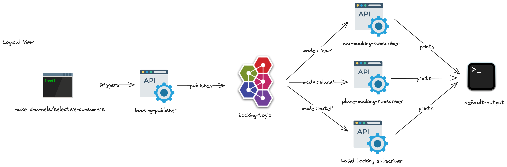

This sample project delves into the implementation of selective consumer patterns within a unified data model framework.

## Overview
We deal with various booking types — flights, accommodations, and vehicle rentals. Our goal is to avoid distinct
communication channels for each type. Instead of multiple data type-specific channels, we utilize a single topic,
booking-topic, for publishing, with three dedicated subscribers for consumption.

## Canonical Data Model
To standardize data handling, we use a canonical data model. This model adopts a generic structure across all booking types:
```
type BookingMessage[T any] struct {
    Model   string `json:"model"`
    Content T      `json:"content"`
}
```
Here, `Content` represents the specific booking details — be it for a flight, hotel, or car — and `Model` designates the
booking category, as specified by the publisher.

## Selective Consumers
The `booking-topic` topic is monitored by three specialized subscribers: `plane-subscriber`, `hotel-subscriber`, and
`car-subscriber`.

Our system uses ActiveMQ as the messaging middleware, utilizing its Selector mechanism. Selectors allow for consumer
filtering using predefined criteria, based on message headers. A publisher sends messages tagged with a model header,
indicating the booking type: plane, hotel, or car. Correspondingly, each subscriber is configured with a selector that
filters messages matching its respective type.

## Architecture

This is a logical view of the application. In practice, the publisher and all subscribers are
in the same Go project, and are all triggered by the Makefile.

## How to Run
The Makefile in the root can spin the docker-compose with the ActiveMQ broker and the Go project.
Simply run `make channels/datatype` and you will see the correct output, with all messages being
correctly consumed.
